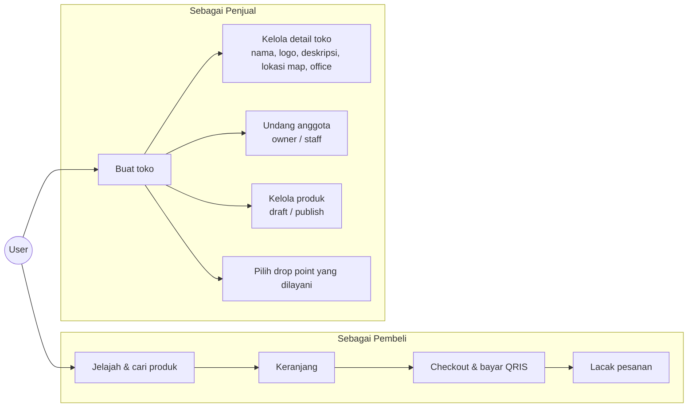
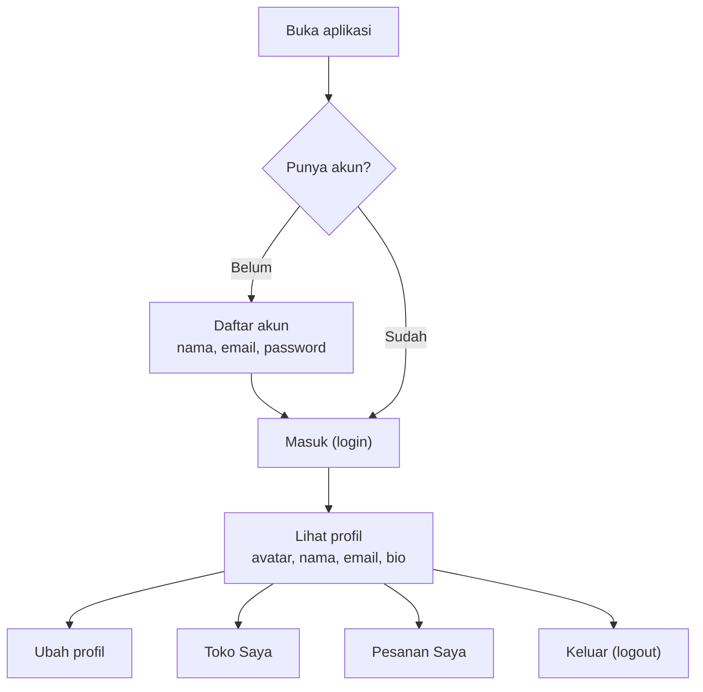
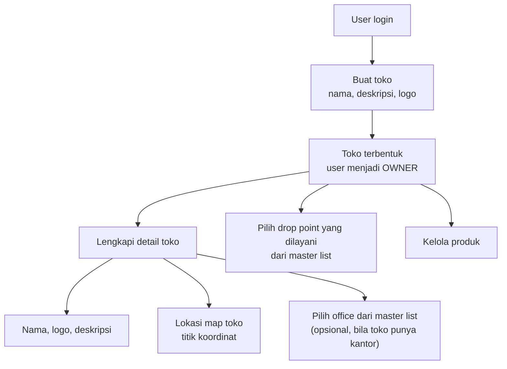
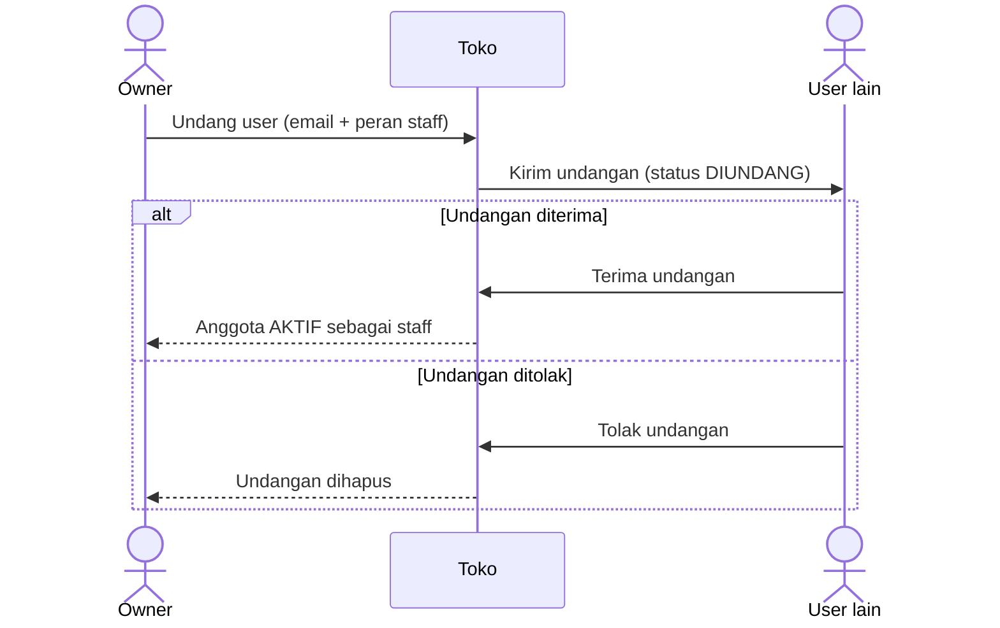
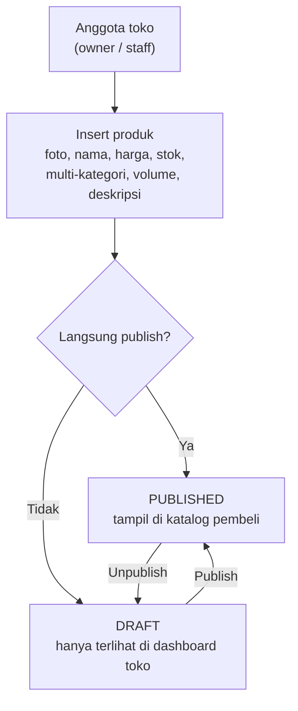
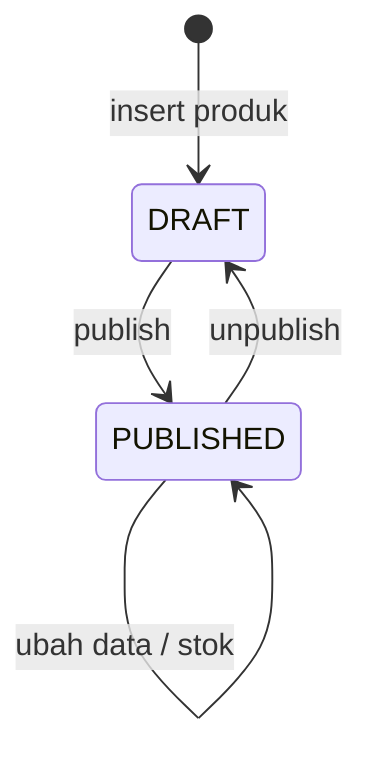
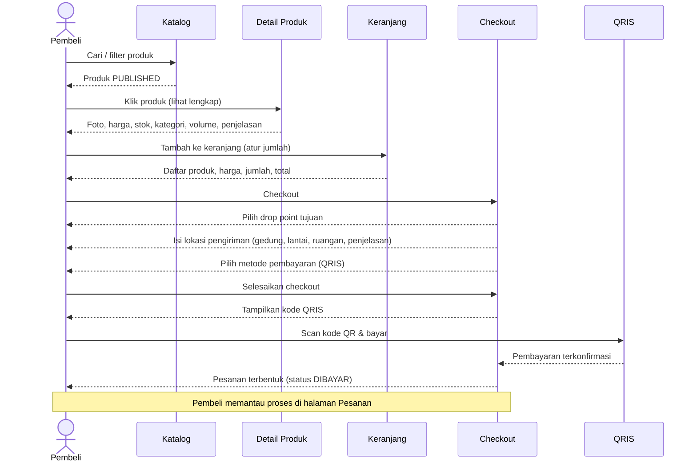
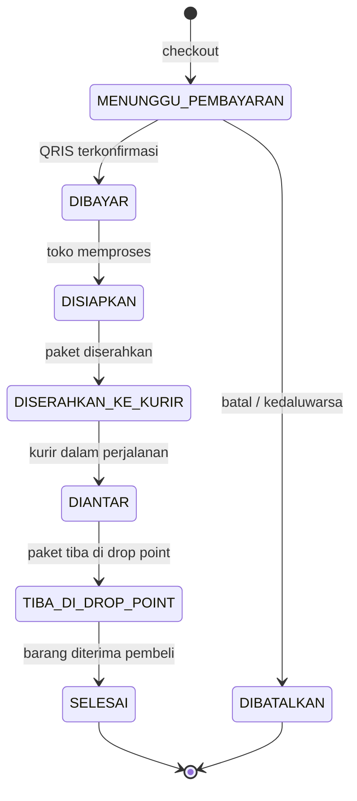

# Desain Alur Aplikasi — Pasar Koperasi

Dokumen ini menjelaskan alur pengguna dan proses bisnis aplikasi marketplace multi-toko
"Pasar Koperasi". Semua diagram memakai [Mermaid](https://mermaid.js.org/) (ter-render otomatis
di GitHub dan preview VSCode). Setiap alur mempunyai layar mockup di `fe-marketplace` —
lihat [Pemetaan Layar](#8-pemetaan-layar).

Backend (`be-marketplace`, Go/Fiber) belum diimplementasikan; dokumen ini menjadi acuan alurnya.

## 1. Ringkasan & Aktor

Satu akun user bisa berperan sebagai **pembeli** sekaligus **penjual**. User dapat mendirikan
lebih dari satu toko dan bergabung sebagai staff di toko milik user lain.

| Aktor | Peran |
|---|---|
| **User** | Mendaftar, masuk, mengelola profil; belanja sebagai pembeli; mendirikan/mengelola toko sebagai penjual |
| **Toko** | Unit usaha milik user; punya anggota (owner/staff), produk, detail (logo, deskripsi, lokasi map), office, dan drop point |
| **Office** | Kantor mitra (bukan toko) — **master data** yang sudah tersedia; toko memilih satu office sebagai lokasi kantornya |
| **Drop Point** | Titik ambil/terima paket — **master data**; toko memilih drop point mana saja yang dilayaninya, pembeli memilih salah satunya saat checkout |
| **Kurir** | Membawa paket dari toko ke drop point |
| **Pembayaran (QRIS)** | Kanal pembayaran saat checkout |

## 2. Peta Fitur

## 3. Alur Akun

Login menjadi prasyarat untuk: membuat/mengelola toko, checkout, dan melihat pesanan.

## 4. Alur Toko

### 4.1 Buat toko & lengkapi detail

### 4.2 Undang anggota toko

Peran anggota: `owner` (pendiri, kontrol penuh) dan `staff` (kelola produk & pesanan).

## 5. Alur Produk

Atribut produk: foto, nama, harga, stok, **beberapa kategori**, volume, deskripsi, dan lainnya.

## 6. Alur Belanja & Pembayaran QRIS

## 7. Status Pesanan

Setelah pembayaran, toko dan kurir menggerakkan status; pembeli memantau lima tahap tracking.

| Status | Yang mengubah | Arti bagi pembeli |
|---|---|---|
| `MENUNGGU_PEMBAYARAN` | Sistem | Selesaikan pembayaran QRIS |
| `DIBAYAR` | Sistem (konfirmasi QRIS) | Pembayaran diterima, menunggu toko |
| `DISIAPKAN` | Toko | Pesanan sedang disiapkan |
| `DISERAHKAN_KE_KURIR` | Toko | Paket diberikan ke kurir |
| `DIANTAR` | Kurir | Paket sedang diantarkan |
| `TIBA_DI_DROP_POINT` | Kurir / drop point | Paket bisa diambil / segera diserahkan di drop point |
| `SELESAI` | Drop point / pembeli | Barang pesanan sudah diterima |
| `DIBATALKAN` | Sistem / pembeli | Pesanan batal (belum dibayar) |

## 8. Pemetaan Layar

Mockup UI (data demo, tanpa backend) ada di `src/pages/`:

| Langkah alur | Route |
|---|---|
| Daftar akun | `/register` |
| Masuk | `/login` |
| Lihat / ubah profil, keluar | `/profile` |
| Daftar toko milik/ikutan user | `/toko` |
| Buat toko | `/toko/buat` |
| Detail toko, anggota, produk, drop point | `/toko/kelola` (4 tab) |
| Insert produk | `/toko/kelola/produk-baru` |
| Jelajah & cari produk | `/` dan `/products` |
| Lihat produk lengkap (klik dari katalog) | `/products/[id]` |
| Keranjang (daftar produk, harga, jumlah, total) | `/cart` |
| Checkout: drop point, lokasi pengiriman (gedung/lantai/ruangan/penjelasan), pilih pembayaran, QRIS | `/checkout` |
| Daftar pesanan (pesanan hasil checkout muncul paling atas) | `/orders` |
| Lacak pesanan contoh (stepper 5 tahap) | `/orders/[id]` |
| Lacak pesanan hasil checkout Anda | `/orders/lacak?id=...` |

Catatan implementasi mockup: keranjang dan sesi login disimulasikan dengan `localStorage`
(`src/lib/cart.ts`, `src/lib/session.ts`); pesanan hasil checkout dibuat lewat API contoh dan
juga disalin ke `localStorage` (`src/lib/my-orders.ts`) sebagai cadangan.

## 9. API Contoh

Server Astro (adapter Node) menyediakan API contoh dengan data statis di `src/pages/api/`.
Semua respons memakai amplop `{ data }` (sukses) atau `{ error }` (gagal). Komponen React
**tidak memanggil `fetch` langsung** — semuanya lewat lapisan service di `src/services/`
(`http.ts` sebagai dasar, lalu `product-service`, `order-service`, `master-service`,
`store-service`), dengan fallback data lokal bila API tak terjangkau.

| Method | Endpoint | Fungsi | Dipakai oleh |
|---|---|---|---|
| GET | `/api/products?q=&kategori=&sort=` | Katalog PUBLISHED + filter server | `ProductBrowser` |
| GET | `/api/products/:id` | Detail satu produk | `ProductPurchase` (validasi stok) |
| GET | `/api/categories` | Master kategori | — |
| GET | `/api/offices` | Master office | — |
| GET | `/api/drop-points` | Master drop point | — |
| GET | `/api/store` | Toko demo + anggota + produk | — |
| GET | `/api/orders` | Pesanan contoh + hasil checkout | `OrdersList` |
| POST | `/api/orders` | Buat pesanan → `MENUNGGU_PEMBAYARAN` | `CheckoutFlow` (Selesaikan Checkout) |
| GET | `/api/orders/:id` | Detail satu pesanan | `OrderTracking` |
| POST | `/api/orders/:id/pay` | Konfirmasi QRIS → `DISIAPKAN` | `CheckoutFlow` (Saya sudah membayar) |

Pesanan hasil `POST` disimpan di memori server (hilang saat restart) — pada aplikasi nyata
seluruh endpoint ini digantikan `be-marketplace`.
